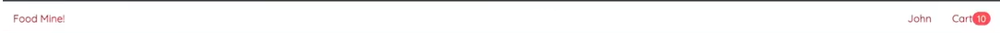

# BellynJoy
**BellynJoy** is a food ordering app that delivers your favourite meals fast, fresh, and with a touch of joy. From street eats to healthy treats, it’s your belly’s happiest shortcut to satisfaction.

- Create a *react app* using the following command :- 
  - **npx create-react-app frontend**. 
- A folder with name "frontend" (React App) will be created.

## Frontend

### Part 1 - Installation

- Install LTS version of **Node.js** for backend (https://nodejs.org/en/download).
- Install **Visual Studio Code** as a code editor (https://code.visualstudio.com/download).
- Install **Git** as a  version control that helps us to manage code changes (https://git-scm.com/downloads).

### Part 2 - Visual Studio Code Configurations

    Install following extensions in VSCode:- 

- ES7+ React/Redux/React-Native Snippets - It helps you in writing the React code easily.
- ESLint - It analyzes the source code for potential errors to enforce coding standards and best practices. 
- Material Icon Theme - It defines the custom file icons.
- Prettier - It makes your code well-formatted.

### Part 3 - Delete unecessary files

- Delete App.test.js
- Delete App.css
- Delete logo.svg
- Delete setupTests.js
- Delete logo192.png
- Delete logo512.png
- Delete manifest.json
- Delete robots.txt

### Part 4 - Delete the entire code inside the following files.

- Delete the code inside index.css file.
- Delete the code and import statements inside App.js file.

### Part 5 - Install & Setup Tailwind CSS in your project

- There are multiple ways through which we can install tailwind css in our project.

    - Using Vite (a JS build tool designed for rapid web development).
    - Using postcss 
    - Using tailwindcss cli (command line interface)
  

**Using Tailwind CSS CLI**

- Run the command in the terminal :- npm install tailwindcss @tailwindcss/cli
- Rename the file with name index.css to input.css and write @import "tailwindcss"; inside input.css.
- Replace the import statement (import ./index.css to import ./output.css) in index.js file.
- Write a script in packae.json file :- 
  - tailwind: npx @tailwindcss/cli -i ./src/input.css -o ./src/output.css --watch
- Run npm run tailwind in one terminal and npm start in another terminal.

### Part 7 - Check whether tailwind css is enabled or not inside your project.
- Add h1 tag with text "Hello" and add attribute class="bg-red".
- If you remove <link href="./output.css" rel="stylesheet"> from index.html file then "Hello" will appear in bigger size as compared to "Hello" printed when <link href="./output.css" rel="stylesheet"> statement is present.

### Part 8 - Install extension for auto suggestion in tailwindcss.

- Install Tailwind CSS IntelliSense extension

### Part 8 - Header Creation

- Open the project folder in vsCode. 
- Go to index.css file and add css (*{box-sizing:border-box;} html{font-size:18px;} body{margin:0; padding:0; font-family:-apple-system, BlinkMacSystemFont, 'Segoe UI', 'Roboto', 'Oxygen',
'Ubuntu', 'Cantarell', 'Fira Sans', 'Droid Sans', 'Helvetica Neue',sans-serif; -webkit-font-smoothing: antialiased; -moz-osx-font-smoothing: grayscale; background-color: #F7F7F7;})
- Create "components" folder inside src folder.
- Create a folder named "Header" inside components folder.
- Create a file named "HeaderComponent.js" inside Header folder.
- Inside the file "HeaderComponent.js" file, write rafce(to generate boilerplate code) and hit enter.
- Keep HeaderComponent.js file opened inside VSCode and in App.js file write "Hea..", it will give you auto suggestion of importing HeaderComponent.js file inside ASpp.js file.If you close Headercomponent.js file inside VSCode, no auto suggestion will be provided.
- To **avoid** above issue, create jsconfig.json file inside frontend folder. Inside this file write :-

  {
    "compilerOptions":{
          "moduleResolution:"node"
    },
    "include":["src"]
  }

- Install "react-router-dom" package to add links in HeaderComponent file. **npm i react-router-dom**.